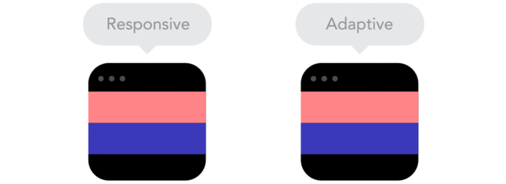

<section align="center">

# 3º Semestre
## 2022

</section>

> IHC - Interação Humano Computador

<div align="center">

## Sumário

</div>

### 1. <a href="#perceptivel">Perceptível</a>
* 1.1<a href="#1.1"> Alternativas de texto </a>
* 1.2<a href="#1.2"> Mídia baseada em tempo </a>
* 1.3<a href="#1.3"> Adaptável </a>
* 1.4<a href="#1.4"> Distinguível </a>
### 2. <a href="#operavel">Operável </a>
* 2.1<a href="#2.1"> Teclado acessível </a>
* 2.2<a href="#2.2"> Tempo suficiente </a>
* 2.3<a href="#2.3"> Convulsões e reações fisícas </a>
* 2.4<a href="#2.4"> Navegável </a>
* 2.5<a href="#2.5"> Modalidades de entrada </a>
### 3. <a href="#compreensivel"> Compreensível </a>
* 3.1<a href="#3.1"> Legível </a>
* 3.2<a href="#3.2"> Previsível </a>
* 3.3<a href="#3.3"> Assistência de entrada </a>
### 4. <a href="#robusto"> Robusto </a>
* 4.1<a href="#4.1"> Compatível </a>

<span id="perceptivel">

### 1. Perceptível

As informações e os componentes da interface do usuário devem ser apresentáveis aos usuários de maneira que eles possam perceber.

<span id="1.1">

#### 1.1 - Alternativas de Texto
Forneça alternativas de texto para qualquer conteúdo que não seja de texto para que possa ser alterado para outras formas que as pessoas precisem, como letras grandes, braille, fala, símbolos ou linguagem mais simples.
  
Podemos utilizar em html um código "alt" para descrever o que temos na imagem, para que o leitor de acessibilidade possa descrever-la

Ex: 

  <section align="center">
  
```HTML

```
    
  </section>

<span id="1.2">

#### 1.2 - Mídia Baseada em Tempo

Forneça legendas e transcrições para conteúdo de áudio e vídeo pré-gravado ou ao vivo, isso o torna acessível para usuários com perda auditiva ou problemas de compreensão da fala.  
  
  <section align="center">
  

  
  </section>
    
> Vídeo utilizado para exemplificar o uso de legendas - [Clique aqui](https://www.youtube.com/watch?v=ZfUwFCCCDh0&ab_channel=serfrontend)

<span id="1.3">

#### 1.3 - Adaptável
  
Criar conteúdos que possam ser apresentados de diferentes formas, sem perder informações ou estrutura.
  
O conteúdo não restringe sua visualização e operação a uma única orientação de exibição (retrato ou paisagem) a menos que uma orientação de exibição específica seja essencial ou pré definida.

  <section align="center">
  
  
    
  </section>

> Porém tem uma diferença entre um site responsivo e adaptativo. Um layout adaptativo é aquele que se adapta ao dispositivo, porém não flui de acordo com o tamanho da janela do usuário. No adaptativo o layout é montado de acordo com o tamanho da janela utilizando **media queries** para readaptar o layout no dispositivo.

<span id="1.4">
  
#### 1.4 - Distinguível
  
  Torne mais fácil para os usuários ver e ouvir o conteúdo, incluindo a separação do primeiro plano do plano de fundo.
  
  <section align="center">
  
  
    
  </section>


<span id="operavel">

### 2. Operável

Os componentes da interface do usuário e a navegação devem ser operáveis.

<span id="compreensivel">

### 3. Compreensível

As informações e a operação da interface do usuário devem ser compreensíveis.

<span id="robusto">

### 4. Robusto

O conteúdo deve ser robusto o suficiente para que possa ser interpretado por uma ampla variedade de agentes de usuário, incluindo tecnologias assistivas.
