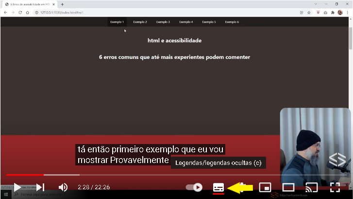

<section align="center">

# VICTORIA MARTO DIAS - 1460482121022
# 3º Semestre
## 2022

</section>

> IHC - Interação Humano Computador

<div align="center">

## Sumário

</div>

### 1. <a href="#perceptivel">Perceptível</a>
* 1.1<a href="#1.1"> Alternativas de texto </a>
* 1.2<a href="#1.2"> Mídia baseada em tempo </a>
* 1.3<a href="#1.3"> Adaptável </a>
* 1.4<a href="#1.4"> Distinguível </a>
### 2. <a href="#operavel">Operável </a>
* 2.1<a href="#2.1"> Teclado acessível </a>
* 2.2<a href="#2.2"> Tempo suficiente </a>
* 2.3<a href="#2.3"> Convulsões e reações fisícas </a>
* 2.4<a href="#2.4"> Navegável </a>
* 2.5<a href="#2.5"> Modalidades de entrada </a>
### 3. <a href="#compreensivel"> Compreensível </a>
* 3.1<a href="#3.1"> Legível </a>
* 3.2<a href="#3.2"> Previsível </a>
* 3.3<a href="#3.3"> Assistência de entrada </a>
### 4. <a href="#robusto"> Robusto </a>
* 4.1<a href="#4.1"> Compatível </a>

<hr>

<span id="perceptivel">

### 1. Perceptível

As informações e os componentes da interface do usuário devem ser apresentáveis aos usuários de maneira que eles possam perceber.

<span id="1.1">

#### 1.1 - Alternativas de Texto
Forneça alternativas de texto para qualquer conteúdo que não seja de texto para que possa ser alterado para outras formas que as pessoas precisem, como letras grandes, braille, fala, símbolos ou linguagem mais simples.
  
Podemos utilizar em html um código "alt" para descrever o que temos na imagem, para que o leitor de acessibilidade possa descrever-la

Ex: 

  <section align="center">
  
```HTML

```
    
  </section>

<span id="1.2">

#### 1.2 - Mídia Baseada em Tempo

Forneça legendas e transcrições para conteúdo de áudio e vídeo pré-gravado ou ao vivo, isso o torna acessível para usuários com perda auditiva ou problemas de compreensão da fala.  
  
  <section align="center">
  

  
  </section>
    
> Vídeo utilizado para exemplificar o uso de legendas - [Clique aqui](https://www.youtube.com/watch?v=ZfUwFCCCDh0&ab_channel=serfrontend)

<span id="1.3">

#### 1.3 - Adaptável
  
Criar conteúdos que possam ser apresentados de diferentes formas, sem perder informações ou estrutura.
  
O conteúdo não restringe sua visualização e operação a uma única orientação de exibição (retrato ou paisagem) a menos que uma orientação de exibição específica seja essencial ou pré definida.

  <section align="center">
  
  
    
  </section>

> Porém tem uma diferença entre um site responsivo e adaptativo. Um layout adaptativo é aquele que se adapta ao dispositivo, porém não flui de acordo com o tamanho da janela do usuário. No adaptativo o layout é montado de acordo com o tamanho da janela utilizando **media queries** para readaptar o layout no dispositivo.

<span id="1.4">
  
#### 1.4 - Distinguível
  
  Torne mais fácil para os usuários ver e ouvir o conteúdo, incluindo a separação do primeiro plano do plano de fundo.
  
  <section align="center">
  
  
    
  </section>
  
Exemplo de NÃO distinguível:

<div align="center">
  
  <br />
  <h4>Nessa parte da página home percebe-se que o branco do notebook da imagem não se distingue do fundo branco da página, encontrada no site da Sabesp.</h4>
</div>


<br>

<h2 id="2.operavel">2. Operável</h2>

<h3 id="2.1_teclado_acessivel">2.1 Teclado Acessível</h3>  
Todas as funcionalidades devem ser interativas a partir de um teclado.

Exemplo de uso de teclas de atalho no twitter:

<div align="center">
  
</div>


<br>

<h3 id="2.2_tempo_suficiente">2.2 Tempo Suficiente</h3>
Permita que os conteúdos a serem exibidos permaneçam na tela por tempo suficiente para que possam ser lidos.

Exemplo de uso em vídeos do youtube:

<div align="center">
  
</div>
<br>

<h3 id="2.3_convulsoes_e_reacoes_fisicas">2.3 Convulsões e Reações Fisícas</h3>
A epilepsia fotossensível é uma condição em que as convulsões são desencadeadas por luzes intermitentes ou padrões contrastantes de luz e escuridão. Tendo em mente essa condição o uso de luzes e super-estímulos vizuais devem ser evitados, caso não seja posível devemos aletar o usuário antes que ele seja exposto a esse típo de conteúdo.


<h3 id="2.4_navegavel">2.4 Navegável</h3>
Forneça maneiras de ajudar o usuário a navegar, encontrar conteúdo e determinar os passos seguintes para chegar ao seu objetivo.

Exemplo de formulário navegável:

<div align="center">
    
</div>

<br>

<!-- <h3 id="2.5_modalidades_de_entrada">2.5 Modalidades de entrada</h3> -->

<h2 id="3.compreensivel">3. Compreensível</h2>

<h3 id="3.1_legivel">3.1 Legível</h3>
A linguagem humana padrão de cada página da Web pode ser determinada programaticamente.

Exemplo de USO:

<div align="center">
  
</div>

Exemplo de NÃO USO:

<div align="center">
  
</div>

<br>

<h3 id="3.2_previsivel">3.2 Previsível</h3>
Páginas da Web, aplicativos e interfaces online devem ser intuitivos e previsíveis em como funcionam. Os sites geralmente têm uma estrutura definida. Isso ajuda as pessoas a encontrar facilmente informações desejadas.

Exemplo de USO e NÃO USO:

<div align="center">
  
</div>

<br>

<h3 id="3.3_assistencia_de_entrada">3.3 Assistência de Entrada</h3>
Ajude o usuário a evitar, buscar e corrigir os erros.

Exemplo:

<div align="center">
  
</div>

<br>

<h2 id="4.robusto">4. Robusto</h2>
O conteúdo deve ser robusto o suficiente para que possa ser interpretado por uma ampla variedade de agentes de usuário, incluindo tecnologias assistivas.

<h3 id="4.1_compativel">4.1 Compatível</h3>
No conteúdo implementado usando linguagens de marcação, as mensagens de status podem ser determinadas programáticamente por meio de função ou propriedades, de modo que possam ser apresentadas ao usuário por tecnologias assistivas sem receber foco.

Exemplo:

<div align="center">
  
</div>


<span id="operavel">

### 2. Operável

Os componentes da interface do usuário e a navegação devem ser operáveis.

<span id="compreensivel">

### 3. Compreensível

As informações e a operação da interface do usuário devem ser compreensíveis.

<span id="robusto">

### 4. Robusto

O conteúdo deve ser robusto o suficiente para que possa ser interpretado por uma ampla variedade de agentes de usuário, incluindo tecnologias assistivas.
